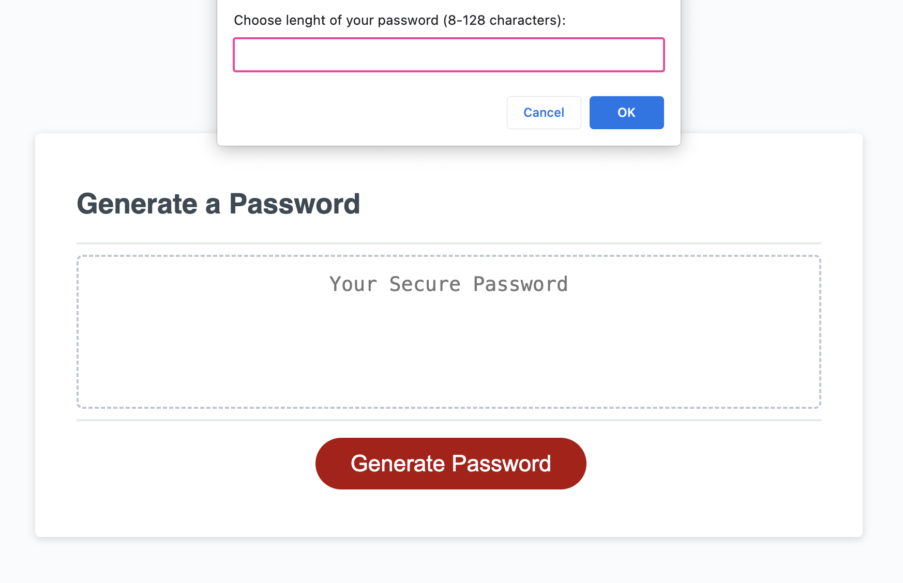
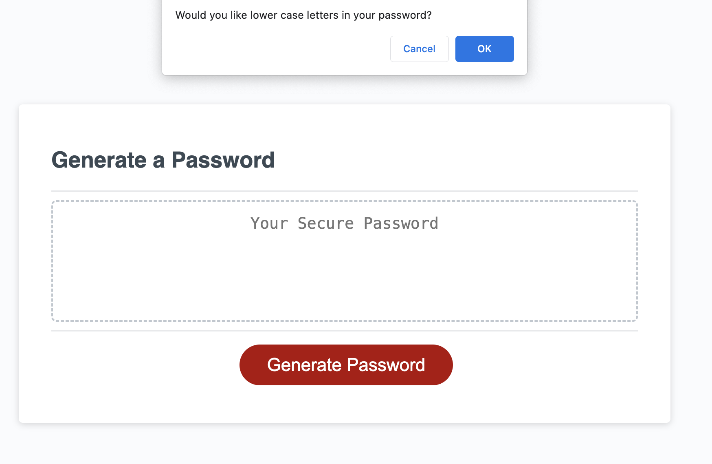
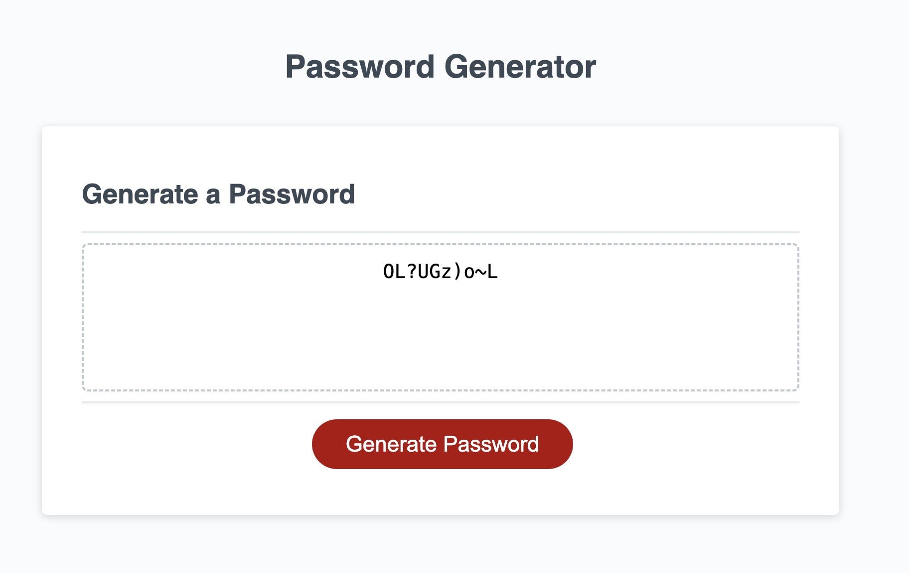

# Password Generator

## Description 

An application that an employee can use to generate a random password based on criteria they’ve selected, like Upper case characters, lower case character, special charasters and number. 

The employee can choose the lenght of the password between 8 and 128 charracgter (inclusive), and then choose their own set of character. Then the characters will be randomly chosen to create a new password.

## Installation

This app runs in the browser, and features dynamically updated HTML and CSS powered by JavaScript.

To access the password generator please [follow the link](https://porlowska.github.io/password-generator/).

Then press "generate password" button.

## Usage 

This app can be used by any person who would like to create secure password, with randomly generated characters, to protect them online. It generates strong passwords, that are difficult to crack, and therfore their data will be protected. 
These passwords are one time only, and not stored in any database.

 

## Credits

get Random function was taken from [this website](https://developer.mozilla.org/en-US/docs/Web/JavaScript/Reference/Global_Objects/Math/random)

## License

MIT License

